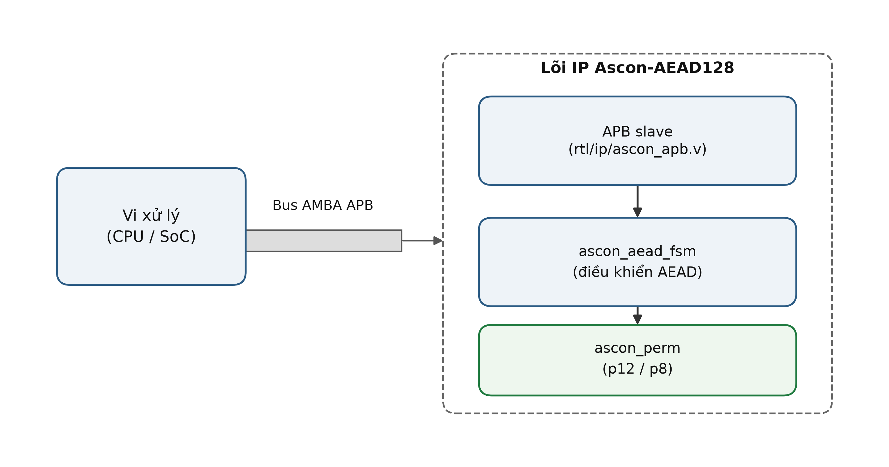
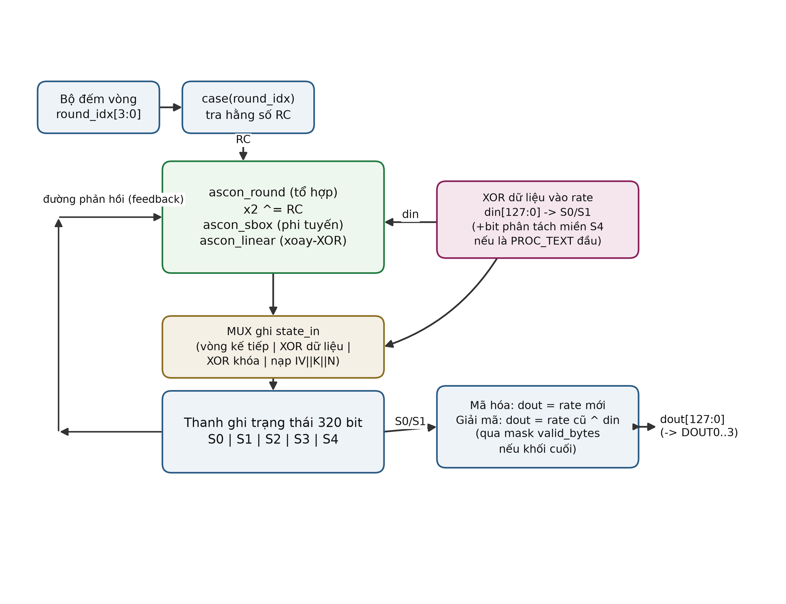
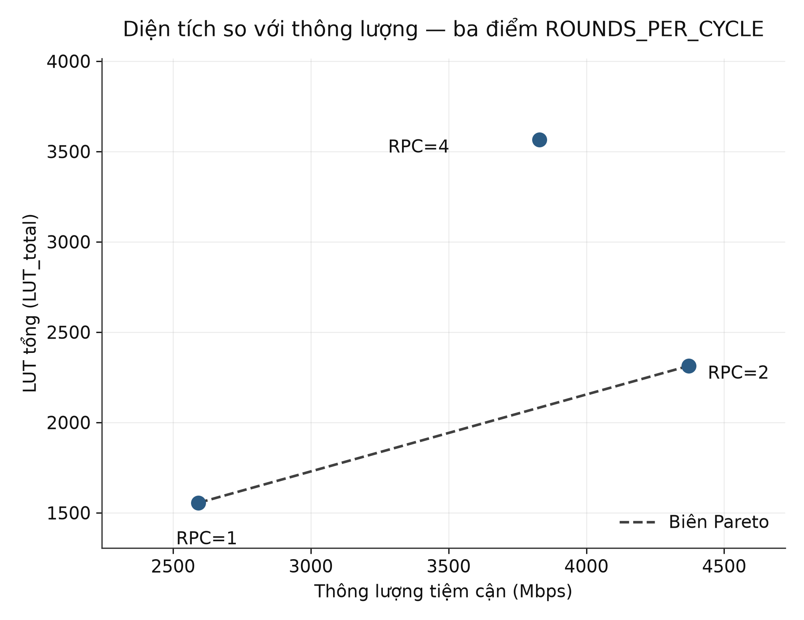

# Ascon-AEAD128 APB IP Core

Hardware IP core implementing Ascon-AEAD128 per NIST SP 800-232, with an AMBA APB slave interface, targeting Xilinx 7-series FPGAs.


## Key results

| | |
|---|---|
| Correctness | 1089/1089 NIST LWC KAT vectors pass, both encrypt and decrypt, plus negative tests (ciphertext/tag/AD corruption → `tag_fail` asserted, plaintext withheld) |
| Protocol | APB checker in pure Verilog reports 0 violations across 1089 transaction sequences |
| PPA (Artix-7, `xc7a35tcpg236-1`, speed grade -1) | RPC=1: 1555 LUT, 182.25 MHz, 1.667 Mbps/LUT · RPC=2: 2313 LUT, 170.74 MHz, 1.890 Mbps/LUT · RPC=4: 3565 LUT, 89.77 MHz, 1.074 Mbps/LUT |
| Fmax across device families (RPC=1) | Artix-7 (-1): 182.25 MHz · Kintex-7 (-2): 304.04 MHz · Virtex-7 (-2): 273.45 MHz |
| Power (RPC=1, Artix-7, gate-level, SAIF-based) | 91 mW total on-chip (23 mW dynamic) |
| Resource usage | 0 BRAM, 0 DSP in all configurations |

`RPC` = `ROUNDS_PER_CYCLE`, the unroll factor of the permutation datapath (see [Design space exploration](#design-space-exploration)).

## Architecture





The core is built bottom-up: `ascon_sbox` + `ascon_linear` → `ascon_round` → `ascon_perm` (stateful permutation engine) → `ascon_aead_fsm` (AEAD control FSM) → `ascon_apb` (APB slave wrapper, the synthesizable top-level unit). `rtl/core/` has no dependency on `rtl/ip/`.

The APB slave exposes a 32-bit register interface (`CMD`, `STATUS`, `KEY0-3`, `NONCE0-3`, `DIN0-3`, `DOUT0-3`, `TAG0-3`, `TAGIN0-3`) driving 128-bit key/nonce/block operations four words at a time. Full register map and operation sequencing are in `docs/spec.md`.

## Design space exploration



Three points were measured on `xc7a35tcpg236-1` by unrolling the permutation datapath (`ROUNDS_PER_CYCLE` = 1, 2, 4 combinational `ascon_round` instances per cycle):

| | RPC=1 | RPC=2 | RPC=4 |
|---|---|---|---|
| Fmax | 182.25 MHz | 170.74 MHz | 89.77 MHz |
| LUT (total) | 1555 | 2313 | 3565 |
| Cycles/block | 9 | 5 | 3 |
| Throughput (asymptotic) | 2592.00 Mbps | 4370.94 Mbps | 3830.19 Mbps |
| Mbps/LUT | 1.667 | 1.890 | 1.074 |

**RPC=2 is the Pareto-optimal point of the three.** Going from RPC=1 to RPC=2, Fmax drops only 6.3% while cycles/block drops 44%, so both throughput and area efficiency improve (+69% throughput, +13% Mbps/LUT). Pushing further to RPC=4 reverses the trend: the four chained combinational rounds add logic levels faster than cycle count drops and Fmax collapses (-47.4%), so RPC=4 ends up *worse* than the RPC=1 starting point on area efficiency (-35.5% Mbps/LUT) despite still beating it on raw throughput. This is a genuine reversal, not a saturation curve — unrolling further than RPC=2 is counterproductive for this design on this device. Full cycle-accounting and critical-path analysis in `docs/uarch.md` (§6-7).

## Verification

| Layer | Tool | What it checks |
|---|---|---|
| Reference model | Python (`model/ascon_model.py`) | Golden model, itself validated against the official NIST KAT vectors |
| Unit tests | Icarus Verilog | `ascon_sbox`, `ascon_linear`, `ascon_round`, `ascon_perm` against the Python model, round by round |
| Directed/KAT tests | Icarus Verilog | Full AEAD FSM against all 1089 `LWC_AEAD_KAT_128_128.txt` vectors, encrypt and decrypt |
| Protocol checker | Pure Verilog SVA-style checker (`tb/sva/apb_checker.v`) | APB timing rules, 0 violations across 1089 sequences |
| Negative tests | Icarus Verilog | Bit-flip on ciphertext/tag/AD → `tag_fail` must assert and the final plaintext block must be withheld |
| Gate-level | Vivado `xsim` on post-route netlist | Functional equivalence (zero-delay) + power (SAIF) on 20 selected KAT vectors |
| Static timing | Vivado `report_timing_summary` on post-route checkpoint | Non-negative WNS at the chosen clock period |

**Security finding — plaintext release before tag verification.** Ascon-AEAD128 is an online cipher: each ciphertext block is produced as soon as the corresponding plaintext block is available, but the authentication tag can only be computed after the entire message has been processed. A first implementation of `ascon_aead_fsm` asserted `dout_valid` unconditionally on every `PROC_TEXT` command during decryption, including the final block — meaning unauthenticated plaintext from the last block could reach the bus before the tag check ever ran. All 1089 KAT vectors still passed, because none of them exercise a corrupted tag. The bug surfaced only when a negative test was written deliberately (flip a ciphertext/tag/AD bit and check `tag_fail`). The fix holds the final block's plaintext in a register and only releases it, gated on `tag_fail == 0`, after the `FINAL` stage completes. Full writeup, including root cause and the general lesson (security requirements must be encoded as an explicit FSM state, not left to "remembering the spec"), is in `docs/BUGS.md`.

## Repository structure

```
docs/          spec.md (register map), uarch.md (FSM/datapath/PPA), test_plan.md, BUGS.md, comparison.md, figures/
model/         Python reference model (golden, validated against NIST KAT)
rtl/core/      ascon_sbox, ascon_linear, ascon_round, ascon_perm, ascon_aead_fsm
rtl/ip/        ascon_apb.v — the synthesizable top-level unit
rtl/demo/      Genesys 2 UART demo wrapper (not part of the core IP)
tb/unit/       per-module tests against the Python model
tb/directed/   NIST KAT tests, negative tests, gate-level testbench
tb/sva/        APB protocol checker
constraints/   XDC files
scripts/       Tcl/Python build and analysis scripts
reports/       tool-generated PPA/timing/power reports
vectors/       NIST KAT file (LWC_AEAD_KAT_128_128.txt)
```

## Getting started

Requires: Icarus Verilog (simulation), Python 3 (reference model), Vivado 2022.2 (synthesis/implementation, Windows or Linux).

```
make model      # run the Python reference model against the NIST KAT
make regress    # run all unit + directed testbenches (Icarus Verilog)
make synth      # Out-of-Context synthesis in Vivado
make impl       # implementation + Fmax sweep
make gatesim    # gate-level functional sim + power (SAIF) + static timing evidence
make bitstream  # full synthesis + implementation + bitstream for the Genesys 2 demo
```

`RPC=2` and `PART=xc7k325tffg900-2` can be appended to `unit`/`kat`/`regress`/`synth`/`impl`/`report` to select the unroll factor or target device, e.g. `make impl RPC=2 PART=xc7vx485tffg1761-2`.

## Comparison with published work

All figures for this project measured on `xc7a35tcpg236-1`, speed grade **-1** (the slowest bin in the Artix-7 family — a conservative baseline; the same RTL on -2/-3 silicon would clock higher).

| Work | Ascon variant | FPGA | Speed grade | LUT | Fmax (MHz) | Throughput (Mbps) | Mbps/LUT | Power (mW) |
|---|---|---|---|---:|---:|---:|---:|---:|
| **This project** | Ascon-AEAD128 (SP 800-232, rate 128, p8) | xc7a35tcpg236-1 | -1 | 1555 | 182.25 | 2592.00 | 1.667 | 91 |
| Alharbi et al. 2024 [4] | Ascon-128 v1.2 (rate 64, p6) | xc7a100tcsg324-3 | -3 | 1756 | 317 | 376 | 0.214 | 222 |
| Malal (n.d.) [5] | ASCON-128 v1.2 (rate 64, p6) | xc7a200tfbg676-2 | -2 | 2957 | 55.25 | 3535.91 | 1.19 | — |
| Malal (n.d.) [5] | ASCON-128a v1.2 (rate 128, p8) | xc7a200tfbg676-2 | -2 | 2183 | 83.33 | 5333.30 | 2.44 | — |

**Note on comparability:** all three published works implement Ascon-128 v1.2 (rate 64 bit, intermediate permutation p6, big-endian) — a different, earlier algorithm variant from Ascon-AEAD128 per NIST SP 800-232 (rate 128 bit, p8, little-endian) implemented here. Rate-64 and rate-128 designs have different throughput ceilings by definition, so absolute Mbps and Mbps/LUT numbers are not directly comparable across the two variants; the table is included for relative positioning within the Ascon family, not as a head-to-head performance claim. ASCON-128a (Malal) uses rate 128, the closest structural match to this project, but is a round-parallel architecture (4 rounds/cycle) versus the single-round-per-cycle (RPC=1) architecture reported above. Full comparison, including Kintex-7/Virtex-7 tables and a serialized-architecture reference point (Mohamed et al.), is in `docs/comparison.md`.

## Limitations

- Not yet loaded onto physical hardware; the Genesys 2 UART demo (`rtl/demo/`) is verified only in Icarus Verilog simulation, not on-board.
- Gate-level *timing* simulation with back-annotated SDF could not be run: the installed Vivado 2022.2 `unisims_ver` simulation library is missing complete specify blocks for `FDCE`, so `xsim` cannot annotate SDF delays. Timing closure is instead evidenced by static timing analysis (`report_timing_summary` on the routed checkpoint) plus a zero-delay gate-level functional simulation; see `docs/BUGS.md` for the full investigation.
- Power is measured only for the RPC=1 configuration on Artix-7; RPC=2/4 and other device families have no power figures.
- A CARRY4 chain shared between the 128-bit tag comparison and the byte-mask output logic could not be eliminated through RTL restructuring or synthesis attributes; it does not currently violate timing but is a known area for further investigation (`docs/BUGS.md`).

## References

[1] NIST SP 800-232, *Ascon-Based Lightweight Cryptography Standards for Constrained Devices*, Aug. 2025.

[2] ARM IHI 0024, *AMBA APB Protocol Specification*.

[3] NIST Lightweight Cryptography Project, `LWC_AEAD_KAT_128_128.txt` known-answer-test vectors.

[4] A. R. Alharbi, A. Aljaedi, A. Aljuhni, M. K. Alghuson, H. Aldawood, and S. S. Jamal, "Evaluating Ascon Hardware on 7-Series FPGA Devices," *IEEE Access*, vol. 12, pp. 149076–149089, 2024, doi: 10.1109/ACCESS.2024.3471694.

[5] A. Malal, "High-Performance FPGA Implementations of Lightweight ASCON-128 and ASCON-128a with Enhanced Throughput-to-Area Efficiency," ASELSAN Inc. and Middle East Technical University, Ankara, Turkey. (Source: https://github.com/AhmetMALAL/ascon-vhdl)

[6] H. A. Mohamed, M. Taher, H. M. Shousha, Z. Mohsen, M. M. Abdelrazik, Y. Ismail, and A. Saeed, "An efficient serialized hardware implementation of the ASCON algorithm," *Scientific Reports*, vol. 16, art. no. 23197, 2026, doi: 10.1038/s41598-026-63223-6.
